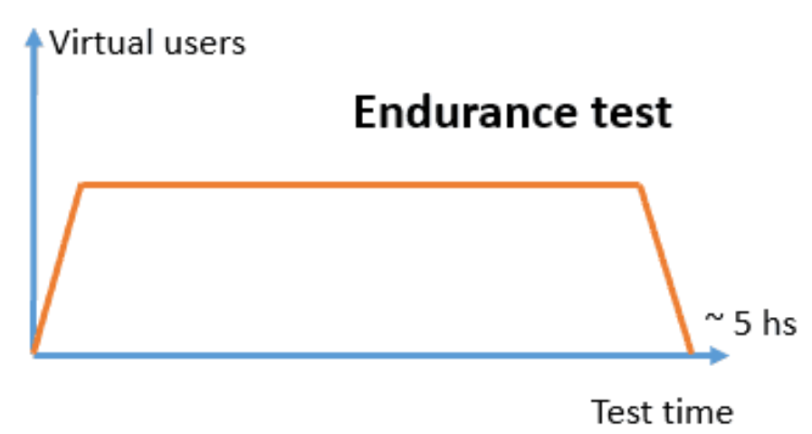
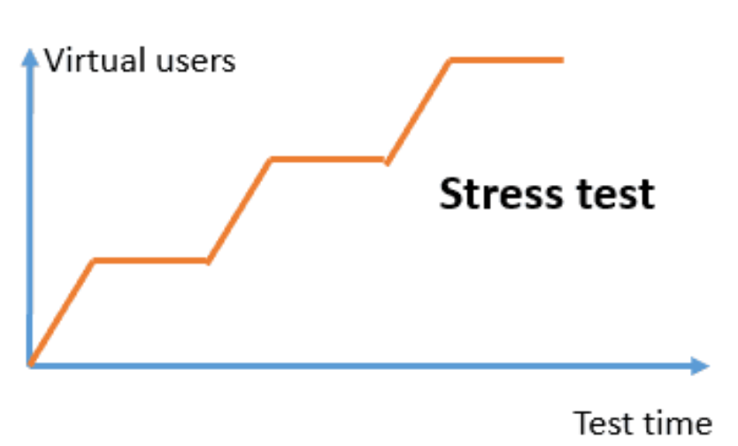
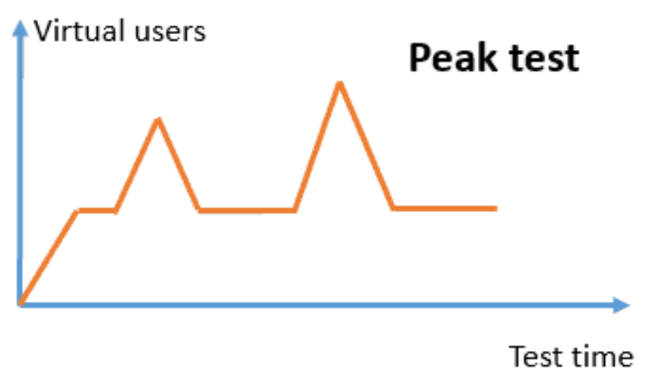
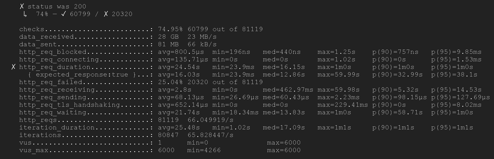

## *load testing* menggunakan aplikasi K6/Grafana [Grafana Cloud k6 | Performance testing tool](https://grafana.com/products/cloud/k6/?src=k6io)
- ### metode menggunakan docker
- menurut saya lebih mudah karena tidak perlu ribet instalasi dan dapat lebih hemat storage
- pertamakali komputer harus terinstall docker
  logseq.order-list-type:: number
- siapkan file skrip pengujian berbahasa javascript dengan skenario sesuai kesepakatan, berikut contoh skenarionya dan kode javascript-nya
  logseq.order-list-type:: number
  **a. general load tes**
  
  
  ```javascript
  import http from 'k6/http';
  import { check, sleep } from 'k6';
  
  export let options = {
      stages: [
  		{ duration: '1m', target: 500 }, // naik ke 500 pengguna dalam 1 menit
  		{ duration: '1m', target: 1000 }, // naik ke 500 pengguna dalam 1 menit      
          { duration: '1m', target: 1500 }, // naik ke 500 pengguna dalam 1 menit
        	{ duration: '1m', target: 2000 }, // naik ke 500 pengguna dalam 1 menit
          { duration: '1m', target: 2500 }, // naik ke 500 pengguna dalam 1 menit
        	{ duration: '1m', target: 3000 }, // naik ke 500 pengguna dalam 1 menit
        	{ duration: '1m', target: 3500 }, // naik ke 500 pengguna dalam 1 menit
          { duration: '1m', target: 4000 }, // naik ke 500 pengguna dalam 1 menit
        	{ duration: '1m', target: 4500 }, // naik ke 500 pengguna dalam 1 menit
        	{ duration: '1m', target: 5000 }, // naik ke 500 pengguna dalam 1 menit
          { duration: '1m', target: 5500}, // naik ke 500 pengguna dalam 1 menit
          { duration: '1m', target: 6000 }, // naik ke 500 pengguna dalam 1 menit
        	{ duration: '36m', target: 6000 }, // tetap di 6000 pengguna dalam 36 menit
  		{ duration: '1m', target: 5500 }, // turun ke 500 pengguna dalam 1 menit
        	{ duration: '1m', target: 5000 }, // turun ke 500 pengguna dalam 1 menit
        	{ duration: '1m', target: 4500 }, // turun ke 500 pengguna dalam 1 menit
        	{ duration: '1m', target: 4000 }, // turun ke 500 pengguna dalam 1 menit
        	{ duration: '1m', target: 3500 }, // turun ke 500 pengguna dalam 1 menit
        	{ duration: '1m', target: 3000 }, // turun ke 500 pengguna dalam 1 menit
        	{ duration: '1m', target: 2500 }, // turun ke 500 pengguna dalam 1 menit
        	{ duration: '1m', target: 2000 }, // turun ke 500 pengguna dalam 1 menit
        	{ duration: '1m', target: 1500 }, // turun ke 500 pengguna dalam 1 menit
        	{ duration: '1m', target: 1000 }, // turun ke 500 pengguna dalam 1 menit
        	{ duration: '1m', target: 500 }, // turun ke 500 pengguna dalam 1 menit
          { duration: '1m', target: 0 }, // turun kembali ke 0 pengguna dalam 1 menit
      ],
      thresholds: {
          http_req_duration: ['p(95)<2000'], // 95% dari request harus di bawah 2 detik
      },
  };
  
  export default function () {
      let res = http.get('https://kemenag-kra.com/'); // URL endpoint
      check(res, { 'status was 200': (r) => r.status == 200 });
      sleep(1); // istirahat 1 detik antara permintaan
  }
  ```
  
  
  **b. endurance tes**  
  
  ```javascript
  import http from 'k6/http';
  import { check, sleep } from 'k6';
  
  export let options = {
      stages: [
  		{ duration: '2m', target: 500 }, // naik ke 500 pengguna dalam 2 menit
  		{ duration: '2m', target: 1000 }, // naik ke 500 pengguna dalam 2 menit      
          { duration: '2m', target: 1500 }, // naik ke 500 pengguna dalam 2 menit
        	{ duration: '2m', target: 2000 }, // naik ke 500 pengguna dalam 2 menit
          { duration: '2m', target: 2500 }, // naik ke 500 pengguna dalam 2 menit
        	{ duration: '2m', target: 3000 }, // naik ke 500 pengguna dalam 2 menit
        	{ duration: '2m', target: 3500 }, // naik ke 500 pengguna dalam 2 menit
          { duration: '2m', target: 4000 }, // naik ke 500 pengguna dalam 2 menit
        	{ duration: '2m', target: 4500 }, // naik ke 500 pengguna dalam 2 menit
        	{ duration: '2m', target: 5000 }, // naik ke 500 pengguna dalam 2 menit
          { duration: '2m', target: 5500}, // naik ke 500 pengguna dalam 20 menit
          { duration: '2m', target: 6000 }, // naik ke 500 pengguna dalam 2 menit
        	{ duration: '252m', target: 6000 }, // tetap di 6000 pengguna dalam 36 menit
  		{ duration: '2m', target: 5500 }, // turun ke 500 pengguna dalam 2 menit
        	{ duration: '2m', target: 5000 }, // turun ke 500 pengguna dalam 2 menit
        	{ duration: '2m', target: 4500 }, // turun ke 500 pengguna dalam 2 menit
        	{ duration: '2m', target: 4000 }, // turun ke 500 pengguna dalam 2 menit
        	{ duration: '2m', target: 3500 }, // turun ke 500 pengguna dalam 2 menit
        	{ duration: '2m', target: 3000 }, // turun ke 500 pengguna dalam 2 menit
        	{ duration: '2m', target: 2500 }, // turun ke 500 pengguna dalam 2 menit
        	{ duration: '2m', target: 2000 }, // turun ke 500 pengguna dalam 2 menit
        	{ duration: '2m', target: 1500 }, // turun ke 500 pengguna dalam 2 menit
        	{ duration: '2m', target: 1000 }, // turun ke 500 pengguna dalam 2 menit
        	{ duration: '2m', target: 500 }, // turun ke 500 pengguna dalam 2 menit
          { duration: '2m', target: 0 }, // turun kembali ke 0 pengguna dalam 2 menit
      ],
      thresholds: {
          http_req_duration: ['p(95)<2000'], // 95% dari request harus di bawah 2 detik
      },
  };
  
  export default function () {
      let res = http.get('https://kemenag-kra.com/'); // URL endpoint
      check(res, { 'status was 200': (r) => r.status == 200 });
      sleep(1); // istirahat 1 detik antara permintaan
  }
  ```
  
  
  
  **c. stres tes** 
  
  ```javascript
  import http from 'k6/http';
  import { check, sleep } from 'k6';
  
  export let options = {
      stages: [
  		{ duration: '2m', target: 500 }, // naik ke 500 pengguna dalam 2 menit
  		{ duration: '2m', target: 1000 }, // naik ke 500 pengguna dalam 2 menit      
          { duration: '2m', target: 1500 }, // naik ke 500 pengguna dalam 2 menit
        	{ duration: '2m', target: 2000 }, // naik ke 500 pengguna dalam 2 menit
        	{ duration: '10m', target: 2000 }, // bertahan 2000 pengguna dalam 10 menit
          { duration: '2m', target: 2500 }, // naik ke 500 pengguna dalam 2 menit
        	{ duration: '2m', target: 3000 }, // naik ke 500 pengguna dalam 2 menit
        	{ duration: '2m', target: 3500 }, // naik ke 500 pengguna dalam 2 menit
          { duration: '2m', target: 4000 }, // naik ke 500 pengguna dalam 2 menit
        	{ duration: '10m', target: 4000 }, // bertahan 4000 pengguna dalam 10 menit
        	{ duration: '2m', target: 4500 }, // naik ke 500 pengguna dalam 2 menit
        	{ duration: '2m', target: 5000 }, // naik ke 500 pengguna dalam 2 menit
          { duration: '2m', target: 5500}, // naik ke 500 pengguna dalam 20 menit
          { duration: '2m', target: 6000 }, // naik ke 500 pengguna dalam 2 menit
        	{ duration: '10m', target: 6000 }, // bertahan 6000 pengguna dalam 10 menit
          { duration: '2m', target: 0 }, // turun kembali ke 0 pengguna dalam 2 menit
      ],
      thresholds: {
          http_req_duration: ['p(95)<2000'], // 95% dari request harus di bawah 2 detik
      },
  };
  
  export default function () {
      let res = http.get('https://kemenag-kra.com/'); // URL endpoint
      check(res, { 'status was 200': (r) => r.status == 200 });
      sleep(1); // istirahat 1 detik antara permintaan
  }
  ```
  
  
   
  **d. peak tes**  
  
  ```javascript
  import http from 'k6/http';
  import { check, sleep } from 'k6';
  
  export let options = {
      stages: [
  		{ duration: '2m', target: 500 }, // naik ke 500 pengguna dalam 2 menit
  		{ duration: '2m', target: 1000 }, // naik ke 500 pengguna dalam 2 menit
        	{ duration: '30s', target: 1000 }, // bertahan dalam 2 30 detik
          { duration: '1m', target: 2000 }, // naik 1000 pengguna dalam 1 menit
        	{ duration: '1m', target: 1000 }, // turun 1000 pengguna dalam 1 menit
        	{ duration: '1m', target: 1000 }, // bertahan dalam 1 menit
        	{ duration: '1m', target: 3000 }, // naik 2000 dalam 1 menit
        	{ duration: '1m', target: 1000 }, // turun 2000 dalam 1 menit
        	{ duration: '1m', target: 1000 }, // bertahan dalam 1 menit
        	{ duration: '1m', target: 4000 }, // naik 3000 dalam 1 menit
        	{ duration: '1m', target: 1000 }, // turun 3000 dalam 1 menit      
        	{ duration: '1m', target: 1000 }, // bertahan dalam 1 menit
        	{ duration: '1m', target: 5000 }, // naik 4000 dalam 1 menit
        	{ duration: '1m', target: 1000 }, // turun 4000 dalam 1 menit
        	{ duration: '1m', target: 1000 }, // bertahan dalam 1 menit
        	{ duration: '1m', target: 6000 }, // naik 5000 dalam 1 menit
        	{ duration: '1m', target: 1000 }, // turun 2000 dalam 1 menit      
        	{ duration: '1m', target: 1000 }, // bertahan dalam 1 menit      
          { duration: '30s', target: 0 }, // turun kembali ke 0 pengguna dalam 2 menit
      ],
      thresholds: {
          http_req_duration: ['p(95)<2000'], // 95% dari request harus di bawah 2 detik
      },
  };
  
  export default function () {
      let res = http.get('https://kemenag-kra.com/'); // URL endpoint
      check(res, { 'status was 200': (r) => r.status == 200 });
      sleep(1); // istirahat 1 detik antara permintaan
  }
  ```
- jalankan perintah untuk menjalankan docker image K6-Grafana dengan menggunakan skenario skrip yang dipilih
  logseq.order-list-type:: number
  
  ```dockerfile
  docker run --rm -v D:/Desktop/latihan:/scripts -i grafana/k6 run /scripts/latihan.js
  
  ```
  
  contoh hasilnya hasil uji skenario peak tes:
  
  ```txt
       ✗ status was 200
        ↳  74% — ✓ 60799 / ✗ 20320
  
       checks.........................: 74.95% 60799 out of 81119
       data_received..................: 28 GB  23 MB/s
       data_sent......................: 81 MB  66 kB/s
       http_req_blocked...............: avg=800.5µs  min=196ns   med=440ns    max=1.25s    p(90)=757ns   p(95)=9.85ms  
       http_req_connecting............: avg=135.71µs min=0s      med=0s       max=1.02s    p(90)=0s      p(95)=1.53ms  
     ✗ http_req_duration..............: avg=24.54s   min=23.9ms  med=16.15s   max=1m0s     p(90)=1m0s    p(95)=1m0s    
         { expected_response:true }...: avg=16.03s   min=23.9ms  med=12.86s   max=59.99s   p(90)=32.99s  p(95)=38.1s   
       http_req_failed................: 25.04% 20320 out of 81119
       http_req_receiving.............: avg=2.8s     min=0s      med=462.97ms max=59.98s   p(90)=5.32s   p(95)=14.53s  
       http_req_sending...............: avg=68.13µs  min=26.69µs med=60.43µs  max=2.23ms   p(90)=98.15µs p(95)=127.69µs
       http_req_tls_handshaking.......: avg=652.14µs min=0s      med=0s       max=229.41ms p(90)=0s      p(95)=8.02ms  
       http_req_waiting...............: avg=21.74s   min=18.34ms med=13.83s   max=1m0s     p(90)=58.71s  p(95)=1m0s    
       http_reqs......................: 81119  66.049919/s
       iteration_duration.............: avg=25.48s   min=1.02s   med=17.09s   max=1m1s     p(90)=1m1s    p(95)=1m1s    
       iterations.....................: 80847  65.828447/s
       vus............................: 1      min=0              max=6000
       vus_max........................: 6000   min=4266           max=6000
  
  ```
  
  
- percobaan ini akan memakan sumber daya memori laptop kita, saran terbaik pada saat pelaksanaan uji load test menggunakan sumber daya Server atau Virtual Private Server
  logseq.order-list-type:: number
-
- **Websites to Practice Hacking Legally**
  HTB
  tryhackme
  overthewire
  hakcthisite
  rootme
  pentesterlab
  CTFtime
  picoCTF
  Cybrary