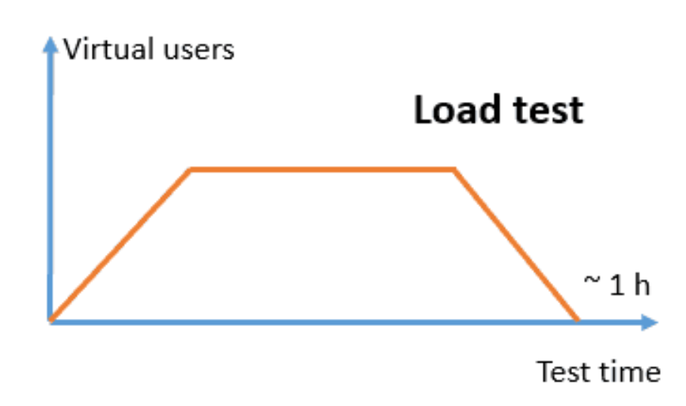

## *load testing* menggunakan aplikasi K6/Grafana [Grafana Cloud k6 | Performance testing tool](https://grafana.com/products/cloud/k6/?src=k6io)
- ### metode menggunakan docker
- menurut saya lebih mudah karena tidak perlu ribet instalasi dan dapat lebih hemat storage
- pertamakali komputer harus terinstall docker
  logseq.order-list-type:: number
- siapkan skrip pengujian berbahasa javascript dengan skenario sesuai kesepakatan
  logseq.order-list-type:: number
  **a. general load tes** 
  **b. endurance tes**  
  **c. stres tes**  
  **d. peak tes**
- logseq.order-list-type:: number
- logseq.order-list-type:: number
- logseq.order-list-type:: number
- logseq.order-list-type:: number